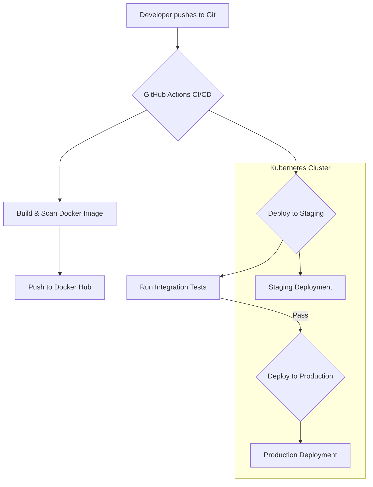

# Project: MLOps Platform for a Decentralized AI Cloud

This repository is a demonstration of the core MLOps infrastructure I designed and built in my role at Planck Network. The goal was to create a robust, reproducible, and automated platform to allow data scientists to train and deploy models on a complex, decentralized compute network.

This project showcases my expertise in Cloud, Kubernetes, Infrastructure as Code (IaC), CI/CD, and MLOps best practices.

## Core Architecture

The platform follows a standard, cloud-native workflow that automates the entire lifecycle from code commit to production deployment. This diagram shows the flow we'll walk through.

---

## Component Breakdown (Our Demo Roadmap)

This README serves as our guide. We will walk through each component to show how the system is built and validated.

1.  **[Infrastructure (`/infrastructure/terraform`)](./infrastructure/terraform)**
    *   **Goal:** Define our cloud environment as code for reproducibility.
    *   **Validation:** We'll use `terraform validate` and `terraform plan`.

2.  **[Application & Container (`/src/app`)](./src/app)**
    *   **Goal:** A production-ready, secure container for our ML model's API.
    *   **Validation:** A multi-stage `Dockerfile` to create a small, secure image.

3.  **[Kubernetes Packaging (`/helm/model-server`)](./helm/model-server)**
    *   **Goal:** Package our application for reliable deployments on Kubernetes.
    *   **Validation:** We'll use `helm lint` and `helm template`.

4.  **[CI/CD Automation (`/.github/workflows`)](./.github/workflows)**
    *   **Goal:** Automate the entire release process from build to deployment.
    *   **Validation:** We'll review a live, successful pipeline run in GitHub Actions.

5.  **[ML Experiment Tracking (`/notebooks`)](./notebooks)**
    *   **Goal:** Ensure every model is versioned and its performance is tracked.
    *   **Validation:** We'll run a notebook and see the results live in the MLflow UI.

---

## What I Would Do Differently

Looking back, while this platform was effective, I would make two key improvements today:
1.  **Implement GitOps with ArgoCD:** Instead of using `helm` commands directly in the CI pipeline, I would have the pipeline publish a new image tag and update a config repository. ArgoCD would then automatically sync the Kubernetes cluster to the state defined in Git. This provides a better audit trail and a single source of truth.
2.  **Use a Dedicated Workflow Orchestrator:** For the ML training part, I would move from simple scripts to a tool like **Argo Workflows or Kubeflow**. This would provide better dependency management, retries, and visualization for complex, multi-step training DAGs.
